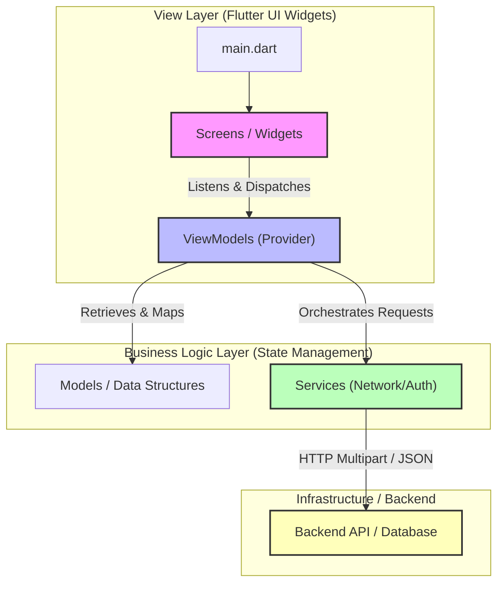

# StylenCut

A premium, boutique grooming booking and scheduling platform built with Flutter. Designed with a custom antique warm-wood and brass aesthetic, StylenCut provides a seamless experience for clients to discover premium salons, pick timeslots, and schedule cuts, while offering salon owners and barbers a powerful, responsive admin portal to oversee daily bookings and live staff availability.

---

## 🌟 Core Features

### 🤵 Client Experience
* **Sleek Boutique Onboarding**: A premium introduction to the grooming experience with custom visual assets.
* **Responsive Browse Portal**: Discover premium salons via an adaptive grid structure that adjusts layout columns dynamically.
* **Premium Split Viewports**: Deep salon inspect screen displaying metadata cards side-by-side with active barber directories on desktop viewports.
* **Adaptive Booking Flow**: Intuitive step-by-step picker for selecting services, barbers, and wrapping time slots.
* **My Bookings History**: Easily keep track of upcoming appointments, completed cuts, and past grooming summaries.
* **Interactive Reviews**: Post ratings and leave grooming feedback directly inside a centered submission card.
* **User Profile Center**: Edit personal settings, pick theme modes, and manage profile photos instantly.

### 💼 Admin & Barbershop Management
* **Horizontal KPI Dashboard**: At-a-glance analytics tracking today's bookings, net sales, waitlist counts, and ratings dynamically.
* **Live Status Sheets**: Update availability status (**Free (Ready for walk-ins)**, **With Client**, or **Busy / On Break**) instantly.
* **Admin Schedule Manager**: View, organize, and track daily appointment lists inside centralized card layouts.
* **Responsive Barber Directory**: Easily register new barbers, manage credentials, edit details, and modify profile cards.

---

## 🏗️ Architecture

StylenCut follows the **MVVM (Model-View-ViewModel)** architectural pattern to ensure separation of concerns and maintainability.



### 1. Structure Directories
* **`lib/models/`**: Defines basic object models (e.g., `Salon`, `BarberModel`, `BookingModel`).
* **`lib/viewmodels/`**: Manages runtime states, loads data asynchronously, notifies listeners, and dispatches updates.
* **`lib/services/`**: Orchestrates external communications (e.g., `AuthService` handles authentication and session tokens, `SalonService` handles endpoints, updates, and uploads).
* **`lib/screens/`**: UI implementations segregated into `/user`, `/admin`, and `/auth` directories.
* **`lib/theme/`**: Configures colors, typography scales, glassmorphism templates, and responsive layouts.

---

## 💎 Advanced Infrastructure Systems

### 1. Cross-Platform Byte-Array Image Uploads
Traditional mobile image uploads rely on local file paths (`dart:io` `File` references), which crash inside web browsers due to browser sandboxing. To ensure flawless cross-platform performance across **Web, Mobile, and Desktop** viewports, StylenCut uses a customized bytes-based uploading system:

* **File Selection**: Employs `ImagePicker` to select images, subsequently reading the file contents into memory as a platform-independent **byte array (`Uint8List`)** and recording its filename.
* **Universal Upload Streams**: The networking layer streams raw bytes to the database upload controllers using `MultipartFile.fromBytes`, avoiding local directory path lookups.
* **Memory-Safe Previews**: Renders real-time selected files using `Image.memory` and database profile urls using `Image.network`.
* **Zero Exception Crashes**: All visual avatars and banners are wrapped in `ClipOval` or `ClipRRect` containing `Image.network` equipped with custom `errorBuilder` configurations. This gracefully handles missing network assets or `NetworkImageLoadException` errors (like 404s) by rendering backup vectors instead of breaking the UI.

### 2. Responsive Navigation Shell & Viewport Adapters
The application adapts seamlessly from a `400px` phone screen to an ultra-wide desktop browser without horizontal stretching:
* **The Breakpoint Engine**: A centralized helper `ResponsiveLayout` divides layouts dynamically (Mobile: `< 600px`, Tablet: `600px - 1024px`, Desktop: `>= 1024px`).
* **Centered Limits (`CenteredBox`)**: Constrains wide, stretched layouts by wrapping form widgets, login pages, and review sheets in a max-width wrapper (centered dynamically using margins).
* **Sidebar Rails**: When viewports exceed `800px`, the standard mobile `BottomNavigationBar` transitions into a custom, antique-wood left-side `NavigationRail` sidebar with brand logos and active indicator overlays.

---

## 🎨 Theme & Visual Identity

StylenCut is themed around a premium, modern boutique grooming design system:
* **Primary Brand Hue**: Muted Antique Gold / Brass (`#C19A6B`)
* **Theme Contrast**: Balanced dark backgrounds (`#1E1E1E`) and bright card layers with harmonized typography.
* **Typography**: Geometric sans-serif typography (`GoogleFonts.poppins` and `GoogleFonts.manrope`) providing premium legibility.
* **Layout Radii**: Consistent, organic rounded corners (` BorderRadius.circular(20)`) and drop-shadow definitions creating modern card overlays.

---

## 🛠️ Tech Stack & Dependencies

* **Language**: [Dart 3.x](https://dart.dev/)
* **SDK**: [Flutter 3.x](https://flutter.dev/)
* **State Management**: [Provider](https://pub.dev/packages/provider)
* **Typography Engine**: [Google Fonts](https://pub.dev/packages/google_fonts)
* **Image Selector**: [Image Picker](https://pub.dev/packages/image_picker)
* **Networking Protocol**: [Http](https://pub.dev/packages/http) and [Http Parser](https://pub.dev/packages/http_parser)

---

## 🚀 Setup & Installation

### Prerequisites
* [Flutter SDK](https://docs.flutter.dev/get-started/install) (`^3.10.3` or higher)
* [Dart SDK](https://dart.dev/get-dart)
* Chrome (for browser execution) or Android/iOS emulator configurations.

### Quick Start
1. **Clone the Repository**:
   ```bash
   git clone <repository_url>
   cd StylenCut
   ```
2. **Install Dependencies**:
   ```bash
   flutter pub get
   ```
3. **Verify Codebase Integrity**:
   Run the static analysis tool to ensure that the code compiles perfectly:
   ```bash
   flutter analyze
   ```
4. **Execute App Locally**:
   Run the application on your active browser or connected emulator:
   ```bash
   flutter run -d chrome
   ```

### 🧪 Automated Tests
Run unit and widget tests to check structural validations:
```bash
flutter test
```
